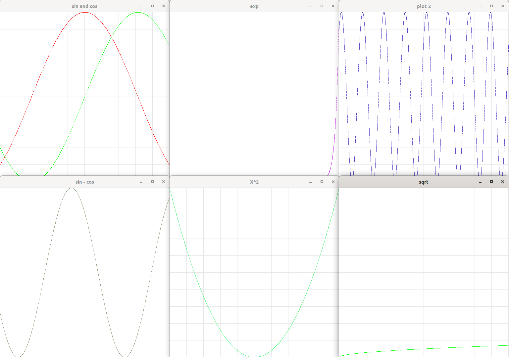

# StepanPlot *ver 0.4*

*header-only* библиотека для построения графика из программы. 



### Особенности

1. Нельзя делать подписи (текст) ~~на данном этапе не возможно реализовать~~.
2. Сетка не центрируется.

### Запуск

Подключить в CMakeLists.txt
```cmake
find_package(OpenGL REQUIRED)
find_package(GLUT REQUIRED)
include_directories(${OPENGL_INCLUDE_DIRS}, ${GLUT_INCLUDE_DIRS})
target_link_libraries(main ${OPENGL_LIBRARIES} ${GLUT_LIBRARIES})
```

### Документация

